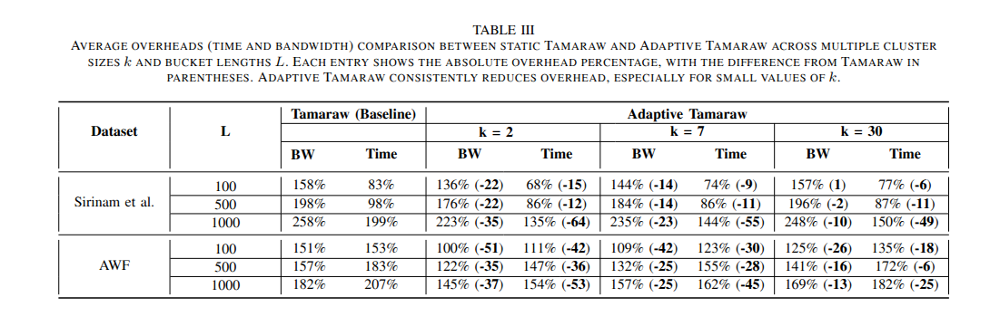

# Adaptive Tamaraw

Official implementation of **"Lightening the Load: A Cluster-Based Framework for A Lower-Overhead, Provable Website Fingerprinting Defense"** accepted at [NDSS 2026](https://www.ndss-symposium.org/ndss2026/).

**Authors:** Khashayar Khajavi and Tao Wang (Simon Fraser University)

📄 [Paper](https://arxiv.org/pdf/2509.01046)

## Overview

Adaptive Tamaraw is a website fingerprinting defense that combines the provable security guarantees of regularization-based defenses with the efficiency of adaptive clustering. The defense:
- Provides **formal, information-theoretic bounds** on attacker success
- Reduces bandwidth and time overhead by up to **99 percentage points** compared to original Tamaraw
- Generalizes to **out-of-training websites** unlike supersequence-based defenses
- Offers **flexible tunability** between privacy and efficiency through the k parameter


## Datasets

This implementation uses two public website fingerprinting datasets:

1. **Sirinam et al. (Tik-Tok) Dataset** 
   - 95 websites, 1,000 traces each
   - Paper: [Deep Fingerprinting: Undermining Website Fingerprinting Defenses with Deep Learning](https://dl.acm.org/doi/pdf/10.1145/3243734.3243768)

2. **AWF Dataset**
   - Top 100 websites, 2,500 traces each
   - Paper: [Automated Website Fingerprinting through Deep Learning](https://www.ndss-symposium.org/wp-content/uploads/2018/02/ndss2018_03A-1_Rimmer_paper.pdf)

We thank the authors for making these datasets publicly available.

## Usage

### Dataset Preparation

Place your dataset (e.g., `Tik_Tok`) in `data/Tik_Tok/` with raw network traces in `data/Tik_Tok/dataset/`. Configuration files should be placed in `configs/Tik_Tok/`.
```bash
# Generate trace representations (TAM, DT, etc.)
python3 -m utils.trace_dataset
```

### Running Adaptive Tamaraw

Below is a complete workflow for running Adaptive Tamaraw with parameters `k=7` and `L=100` on the `Tik_Tok` dataset:

#### Step 1: Build Trace Dictionaries

Generate defended traces for different Tamaraw configurations. For efficiency, you can partition the workload:
```bash
# Example: Process traces 0-8000
python3 -m src.experiments.fixed_defenses.Tamaraw.tamaraw_per_trace \
    -n_cores 50 -partitions 10 -start_trace 0 -end_trace 8000

# Example: Process traces 8000-16000
python3 -m src.experiments.fixed_defenses.Tamaraw.tamaraw_per_trace \
    -n_cores 50 -partitions 10 -start_trace 8000 -end_trace 16000
```

#### Step 2: Consolidate Trace Dictionaries

If you divided traces in Step 1, merge them into a complete dictionary:
```bash
python3 src/experiments/fixed_defenses/Tamaraw/build_trace_L_dict.py
```

#### Step 3: Compute Tamaraw Overheads

Calculate bandwidth and time overheads for different Tamaraw configurations:
```bash
python3 -m experiments.fixed_defenses.Tamaraw.optimize_tamaraw \
    -n_cores 1 -L 100 -preload_ohs True -conf Tik_Tok
```

#### Step 4: Pattern Extraction with CAST

Extract intra-webpage traffic patterns using the modified CAST algorithm:
```bash
# Compute distance matrices for each website
python3 -m experiments.datasets.per_website_distance_matrix -conf Tik_Tok

# Run CAST clustering on each website
python3 -m experiments.clustering.overall_cast \
    -conf Tik_Tok -website -1 -preload True -save_clusters True \
    -max_clusters 5 -save True
```

#### Step 5: Anonymity Set Generation

Cluster traffic patterns into k-anonymous, l-diverse anonymity sets:
```bash
# Two-tier clustering (CAST + Palette-Tamaraw)
python3 -m experiments.clustering.two_tier_clustering \
    -alg1 cast -alg2 palette_tamaraw -conf Tik_Tok -k 7 \
    -preload_clusters True -save True -save_clusters True -l_tamaraw 100

# Optimize Tamaraw parameters for each cluster
python3 -m experiments.fixed_defenses.Tamaraw.optimize_tamaraw_clusters \
    -n_cores 1 -k 7 -alg2 palette_tamaraw -preload_ohs True \
    -conf Tik_Tok -l_tamaraw 100
```

#### Step 6: Create Switching Table

Generate the mapping from global configurations to cluster-specific configurations:
```bash
python3 -m experiments.fixed_defenses.Tamaraw.create_switching_table \
    -k 7 -alg2 palette_tamaraw -l_tamaraw 100 -top_configs 50 -conf Tik_Tok
```

#### Step 7: Train k-Fingerprinting Models

Train per-website k-FP classifiers for pattern identification:
```bash
python3 -m experiments.early_detection.within_website_classification \
    -alg1 cast -alg2 palette_tamaraw -config Tik_Tok -k 7 \
    -preload_clusters True -save True -l_tamaraw 100
```

#### Step 8: Setup Holmes Model

We use the [Holmes framework](https://github.com/Xinhao-Deng/Website-Fingerprinting-Library) for early webpage prediction:

1. Train Holmes on your dataset using their repository
2. Generate predictions on test data for different trace percentages (p = 20, 21, ..., 100)
3. Save prediction files as `taf_test_p{p}_Holmes_predictions.npy` in `data/holmes/{dataset}/holmes_predictions/`
4. Save test indices as `test_indices.npy` in `data/holmes/{dataset}/`

#### Step 9: Generate Holmes + k-FP Predictions

Combine Holmes webpage predictions with k-FP pattern predictions:
```bash
python3 -m experiments.fixed_defenses.Tamaraw.tamaraw_two_tier_holmes_kfp_ECDIRE \
    -k 7 -alg2 palette_tamaraw -l_tamaraw 100 -conf Tik_Tok
```

#### Step 10: Compute Safe Timestamps with ECDIRE

Determine safe switching times for each anonymity set using different confidence thresholds (α):
```bash
# α = 0.5
python3 -m experiments.early_detection.ecdire \
    -k 7 -l_tamaraw 100 -conf Tik_Tok -alg2 palette_tamaraw -perc_acc 0.5

# α = 0.6
python3 -m experiments.early_detection.ecdire \
    -k 7 -l_tamaraw 100 -conf Tik_Tok -alg2 palette_tamaraw -perc_acc 0.6

# α = 0.7
python3 -m experiments.early_detection.ecdire \
    -k 7 -l_tamaraw 100 -conf Tik_Tok -alg2 palette_tamaraw -perc_acc 0.7

# α = 0.8
python3 -m experiments.early_detection.ecdire \
    -k 7 -l_tamaraw 100 -conf Tik_Tok -alg2 palette_tamaraw -perc_acc 0.8

# α = 0.9 (default)
python3 -m experiments.early_detection.ecdire \
    -k 7 -l_tamaraw 100 -conf Tik_Tok -alg2 palette_tamaraw -perc_acc 0.9
```

#### Step 11: Apply Adaptive Defense

Execute the complete adaptive defense with global-to-local switching:
```bash
python3 -m experiments.fixed_defenses.Tamaraw.tamaraw_two_tier_holmes_kfp_ecdire_switch \
    -conf Tik_Tok -n_cores 1 -k 7 -alg2 palette_tamaraw -l_tamaraw 100 \
    -top_configs 50 -start_config 0 -end_config 32
```

#### Step 12: Evaluate Against Attacks

Train and evaluate state-of-the-art WF attacks on defended traces:
```bash
python3 -m experiments.fixed_defenses.Tamaraw.tamaraw_two_tier_vs_attacks \
    -n_cores 1 -k 7 -l_tamaraw 100 -start_config 0 \
    -alg2 palette_tamaraw -train_config TT -attack_type Tik_Tok
```

**Note:** For LASERBEAK evaluation, use the [official LASERBEAK implementation](https://github.com/notem/Laserbeak-WF-Classifier). The above command will save traces in the appropriate format for LASERBEAK training.

## Key Parameters

- **k**: Anonymity set size (controls privacy-efficiency tradeoff)
  - Smaller k → lower overhead, weaker privacy guarantees
  - Larger k → higher overhead, stronger privacy guarantees
  - Default: 7

- **L**: Tamaraw bucket length parameter
  - Common values: 100, 500, 1000
  - Larger L provides better security but higher overhead
  - Default: 100

- **α (perc_acc)**: ECDIRE confidence threshold
  - Range: 0.5 to 1.0
  - Controls when to switch from global to local parameters
  - Default: 0.9

## Results Summary




## Citation

If you use this code in your research, please cite:
```bibtex
@article{khajavi2025lightening,
  title={Lightening the Load: A Cluster-Based Framework for A Lower-Overhead, Provable Website Fingerprinting Defense},
  author={Khajavi, Khashayar and Wang, Tao},
  journal={arXiv preprint arXiv:2509.01046},
  year={2025}
}
```


## Contact

For questions or issues, please open an issue on GitHub or contact:
- Khashayar Khajavi: kka151@sfu.ca
- Tao Wang: taowang@sfu.ca

## Acknowledgments

We thank the authors of the Sirinam et al. and AWF datasets, as well as the developers of the Holmes and LASERBEAK frameworks, for making their work publicly available.